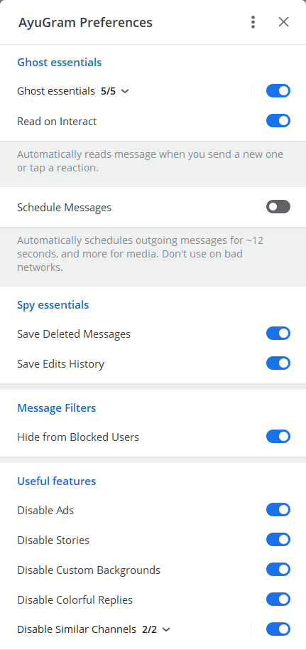
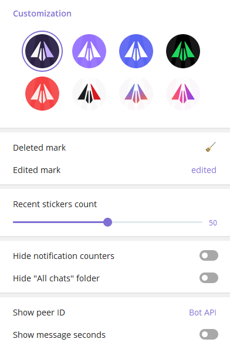
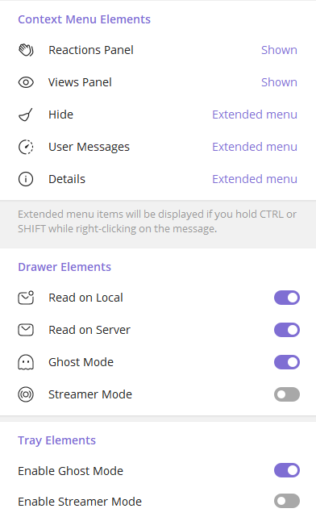

# AyuGram

## Features

- Full ghost mode (flexible)
- Messages history
- Anti-recall
- Font customization
- Streamer mode
- Material Design switches
- Local Telegram Premium
- Sync read states and message history with AyuSync *(TBA)*

  

## Downloads

### Windows

You can download prebuilt Windows binary from [Releases tab](https://github.com/AyuGram/AyuGramDesktop/releases) or from
the [Telegram topic](https://t.me/ayugramchat/12788).

Follow [official guide](https://github.com/AyuGram/AyuGramDesktop/blob/dev/docs/building-win-x64.md) if you want to
build by yourself.

### Arch Linux

It is recommended to build AyuGram from source on any Linux distro.

But if you're brave enough, you can install `ayugram-desktop-git` or `ayugram-desktop-bin`
from [AUR](https://aur.archlinux.org/packages?O=0&K=ayugram).

These packages maintained by [westpain](https://github.com/incycledream). *We're not responsible for them.*

### Any other Linux distro

Follow the [official guide](https://github.com/AyuGram/AyuGramDesktop/blob/dev/docs/building-linux.md).

### Remarks for Windows

Make sure you have these components installed with VS Build Tools:

- C++ MFC latest (x86 & x64)
- C++ ATL latest (x86 & x64)
- latest Windows 11 SDK

## Donation

If you enjoy using **AyuGram** and want to send us a tip, here's how you can do it:

- Using [Boosty](https://boosty.to/alexeyzavar) - any card and PayPal
- Using cryptocurrency - `TRpbajq38qU8joThgAfKJLyEPbNjzsdPJ1` (Tron + USDT)

## Credits

- [Telegram Desktop](https://github.com/telegramdesktop/tdesktop)
- [Kotatogram](https://github.com/kotatogram/kotatogram-desktop)
- [64Gram](https://github.com/TDesktop-x64/tdesktop)
- [Forkgram](https://github.com/forkgram/tdesktop)
- [SQLite](https://github.com/sqlite/sqlite)
- [sqlite_orm](https://github.com/fnc12/sqlite_orm)

### Very special thanks to

- [Solar Icon Set](https://solariconset.com/)
- [JSON for Modern C++](https://github.com/nlohmann/json)
- [BitConverter](https://github.com/YanjieHe/BitConverter)
- [Not Enough Standards](https://github.com/Alairion/not-enough-standards)
