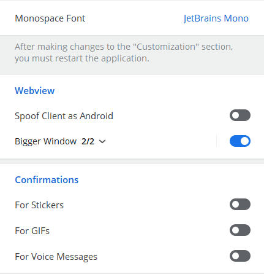

# AyuGram

 

## Features

- Full ghost mode (flexible)
- Messages history
- Anti-recall
- Font customization
- Streamer mode
- Local Telegram Premium
- Enhanced appearance

And many more. Check out our [Documentation](https://docs.ayugram.one/desktop/).

## Preferences screenshots




## Downloads

### Windows

#### Official

You can download prebuilt Windows binary from [Releases tab](https://github.com/AyuGram/AyuGramDesktop/releases) or from
the [Telegram topic](https://t.me/ayugramchat/12788).

#### Scoop

```bash
scoop bucket add extras
scoop install ayugram
```

#### Self-built

Follow [official guide](https://github.com/AyuGram/AyuGramDesktop/blob/dev/docs/building-win-x64.md) if you want to
build by yourself.

### Arch Linux

You can install `ayugram-desktop` or `ayugram-desktop-git` from [AUR](https://aur.archlinux.org/packages?O=0&K=ayugram).

### Any other Linux distro

Follow the [official guide](https://github.com/AyuGram/AyuGramDesktop/blob/dev/docs/building-linux.md).

### Remarks for Windows

Make sure you have these components installed with VS Build Tools:

- C++ MFC latest (x86 & x64)
- C++ ATL latest (x86 & x64)
- latest Windows 11 SDK

## Donation

Enjoy using **AyuGram**? Consider sending us a tip!

[Here's available methods.](https://docs.ayugram.one/donate/)

## Credits

### Telegram clients

- [Telegram Desktop](https://github.com/telegramdesktop/tdesktop)
- [Kotatogram](https://github.com/kotatogram/kotatogram-desktop)
- [64Gram](https://github.com/TDesktop-x64/tdesktop)
- [Forkgram](https://github.com/forkgram/tdesktop)

### Libraries used

- [JSON for Modern C++](https://github.com/nlohmann/json)
- [SQLite](https://github.com/sqlite/sqlite)
- [sqlite_orm](https://github.com/fnc12/sqlite_orm)

### Icons

- [Solar Icon Set](https://www.figma.com/community/file/1166831539721848736)
